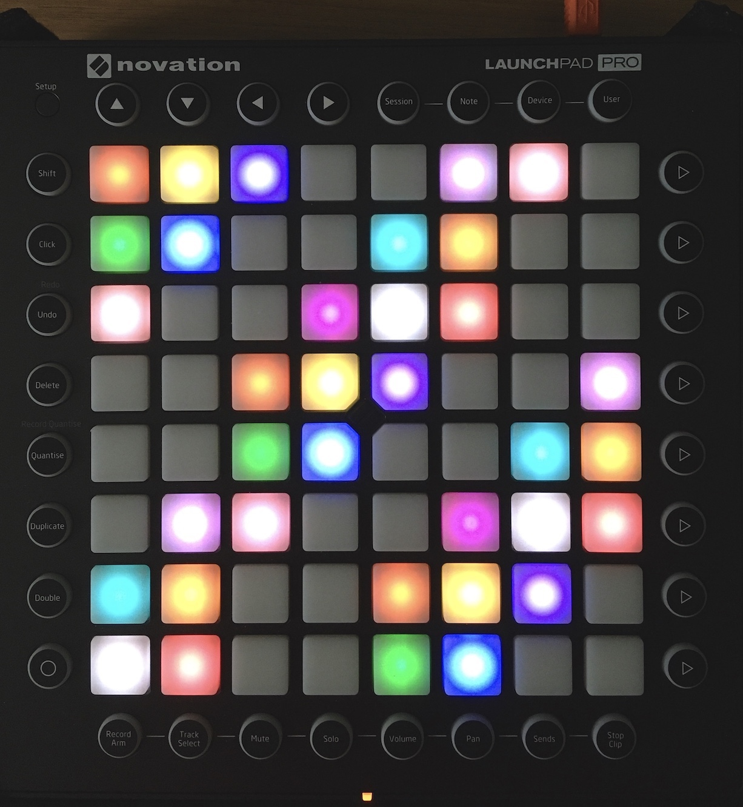
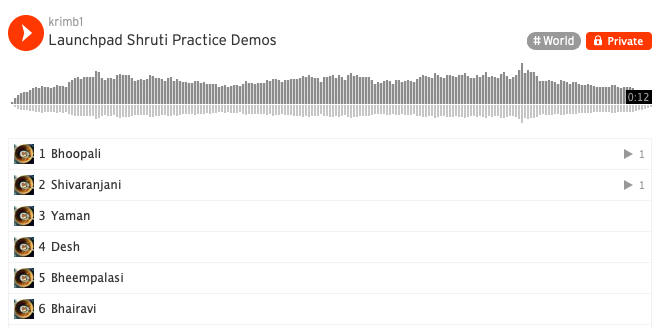
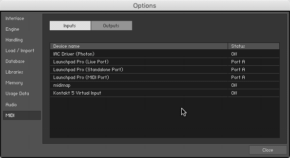
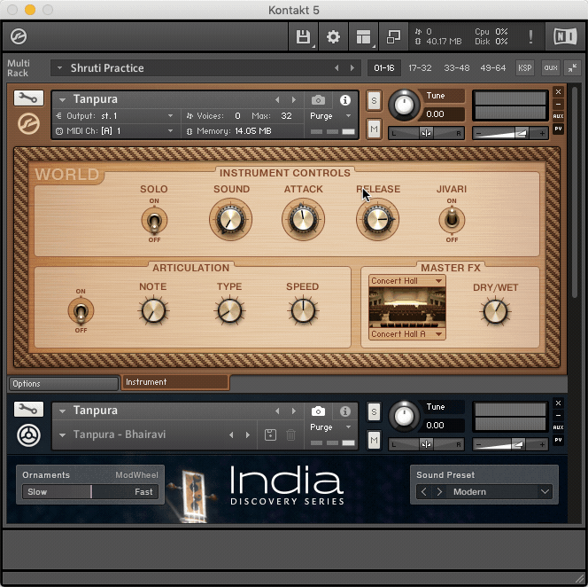
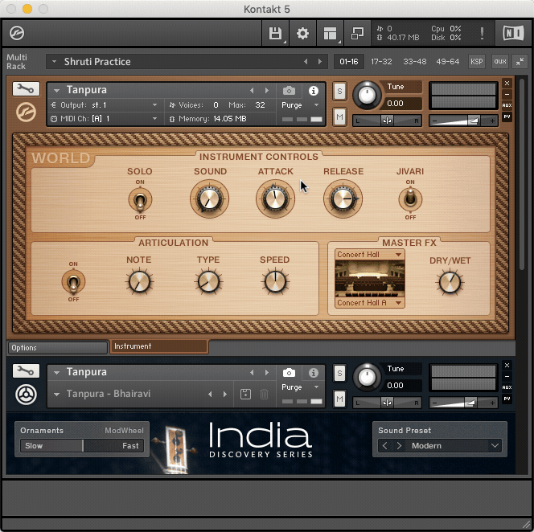

# launchpad-shruti-practice

Using a Novation Launchpad Pro to practice the 22 shrutis of Indian classical music.

## Who Might Use This

### Students

* Ear training - what do the different shrutis sound like? Am I able to notice a difference today? With practice, is my ear improving?
* Exploration - what does a Raga sound like with its correct shrutis? What makes it correct? What does it sound like if I use the other shrutis? Can I tell the difference at very soft volumes?
* Vocal training - sing first and verify intonation after by using the Launchpad. What are my tendencies? Am I sharp or flat today?
* Transcription - try out different grace notes (kan swaras). Which ones sound like the song?

### Teachers

* Visualize - music learning can be both auditory as well as visual!  How large are the intervals? Which groups of notes (angs) are the same between Ragas? What patterns do they make?
* Explain - compare and contrast the shrutis used by different Ragas. What is common to Ragas the student has previously studied? What makes this one unique? What gives it its character (bhava)?
* Reveal - underlying harmonic relationships among shrutis. Which notes are related by perfect fifths and major thirds?
* Inuit - tonal centers in Ragas (vadi/samvadi swaras). Which notes anchor the others?

### Creators

* Swar mandal - the Launchpad makes a nice, well-tuned swar mandal!
* Extend - apply the same tuning to any MIDI instrument of your choice

## Crash Course on 22 Shrutis

For the purpose of how and why these 22 notes are used, here are the most salient ideas. The key of C is assumed in all examples.

* There are 12 chromatic notes in an octave, just like Western music
* The 22 shrutis are a way of tempering these 12 chromatic notes based on Raga
  * Enharmonic notes such as G# and Ab are tuned differently
* The 22 shrutis are derived from the 12 chromatic notes by keeping C and G (Shadaj and Pancham) fixed and splitting the remaining 10 notes into two 
  * 2 + (10 x 2) = 22
  * There is no Raga that contains both pairs of enharmonic notes
  * Thus there are not 22 chromatic notes
* For notation purposes, the black notes are given lowercase letters (r, g, m, d, n) whereas white keys have uppercase letters (S R G M P D N)
  * The black notes are komal (flat) and tivra (sharp) aka modified (vikrt)
  * The white notes are shudda (without accidentals)
* There are two branches of enharmonic notes
  * Upward perfect fifths - based on Pancham
  * Downward perfect fourths - based on Madhyam
* Both Western and Indian Raga music have uniquely evolved to tradeoff opposites
  * Western music trades off temperments for Equal tempermaent [in the early 19th century](https://en.wikipedia.org/wiki/Equal_temperament#Baroque_era) for harmonic freedom and polyphony. This enables large orchestras with fixed pitch instruments, jazz and atonality.
  * Raga music exclusively explores the subtleties and moods of these temperaments by trading away polyphony. Philosophically, it mirrors the idea there is only one. This places special importance on variable pitch instruments (like voice and sitar) and creates harmony only within one's own melodic reverb. 
* Today's world has the great opportunity to listen to, reflect upon and respect these two unique, highly-evolved musical traditions—recognizing they are but siblings of the same root.

## Audio Demos in Ragas

Hearing is believing! Quick 15 second demos of various Ragas encompassing 16 of the 22 shrutis.

Each demo features the arohi (ascending scale), avarohi (descending scale), and concludes with a faster swar mandal-like descending flourish that really brings out the combined, blending consonance aka mood (bhava) of the Raga.

Particularly interesting notes to listen for are indicated in bold.

The MP3s are saved inside the `docs/` folder, but for GitHub.com and mobile convenience here is a Soundcloud playlist as well.

* Bhoopali
  * S R2 **G1** P **D1** S' | S' **D1** P **G1** R2 S
* Shivranjani
  * S R2 **g2** P **D2** S' | S' **D2** P **g2** R2 S
* Yaman 
  * **N1** R2 **G1** **m1** **D2** **N1** S' | S' **N1** **D2** P **m1** **G1** R2 S
* Desh
  * S R2 M1 P **N1** S' | S' **n1** **D1** P M1 **G1** R2 S
* Bheempalasi
  *  in Madhyam tuning
  * <u>**n1**</u> S **g1** M1 P **n1** S' | S' n1 **D1** P M1 **g1** **R1** S 
  * would give **R1** extra bolding if I could!

* Bhairavi
  * S **r2** g2 **M2** P d2 **n2** S' | S' **n2** d2 P **M2** g2 **r2** S

More about the tuning in the [Shruti](#shruti-colors) section.

## Prerequisites

* Launchpad Pro
  - Only Pro supports Programmer aka custom MIDI mode and RGB colors
* Mac OS X
  - Tested on 10.14 Mojave
  - [Midimap](https://github.com/voidqk/midimap) for Mac (prebundled)
* Native Instruments
  - Kontakt Player
    - Free player is OK to use the already exported pratice sets `.nki` files. Otherwise the paid version is required to access the script editor (see below)
  - Kontakt Factory Library
    - Used for the playable Tanpura
    - Specifically just the `World/6 - Strings/Tanpura.nki` sample
  - [India Discovery Series](https://www.native-instruments.com/en/products/komplete/world/india/) (optional)
    - For the background tanpura, very rich sound

See [Native Instruments Komplete Version Comparison](https://docs.google.com/spreadsheets/d/1C2lEubeNV6OzUnj5o8o6pBPU_jGgzeCALNTLOnoPxeA/edit?usp=drive_web&ouid=113346694824160986526) for an awesome spreadsheet to help identify which Komplete bundles contain these libraries.

## How to Use

1. Connect the Launchpad Pro via USB and enter Programmer Mode. See the [Launchpad Pro User Guide](https://resource.novationmusic.com/support/product-downloads?product=Launchpad+Pro) for details.

2. Open Terminal and run the background MIDI daemon: `sh start.sh`

3. Double click the `Shruti Practice.nkm` practice file to launch/reload Kontakt/Kontakt Player

4. Open MIDI Preferences. Turn off mapping for default Launchpad inputs. Set `midimap` to Port A. 

5. Adjust the key root. By default the scale is set to C. (The demo below shows how to adjust it to D i.e. two half steps.)

   1. Set the `Tune` parameter to the number of half steps in the top, playable instrument.
   2. Set the `Root` key in the second background tanpura instrument.
   3. Press the ▶️ icon to start the background tanpura. 
   4. To adjust tuning of Concert A (default 440Hz), open the `Master` pane and adjust the `Master Tune` parameter as needed. 

6. Save your settings to a new file by clicking `Load/Save` (floppy disk icon) > `Save Multi as...` 

## Shruti Colors

### Definition

The ratios of the 22 shrutis used are the same as those defined and researched by Dr. Vidyadhar Oke. The RGB values are sent via Sysex commands and are specified in `lpp-colors.smidi`.

| **Shruti** | **Ratio** | **ET Offset (Cents)** | **Launchpad RGB** | **Color**    |
| ---------- | --------- | --------------------- | ----------------- | ------------ |
| S          | 1         | 0.0                   | 25 25 25          | White        |
| r1         | 256/243   | -9.8                  | 30 2  2           | Red          |
| r2         | 16/15     | 11.7                  |                   |              |
| R1         | 10/9      | -17.6                 |                   |              |
| R2         | 9/8       | 3.9                   | 0  10 0           | Green        |
| g1         | 32/27     | -5.9                  | 5  5  63          | Blue         |
| g2         | 6/5       | 15.6                  |                   |              |
| G1         | 5/4       | -13.7                 |                   |              |
| G2         | 81/64     | 7.8                   | 0  80 80          | Aquamarine   |
| M1         | 4/3       | -2.0                  | 24 8  0           | Light Orange |
| M2         | 27/20     | 19.6                  |                   |              |
| m1         | 45/32     | -9.8                  |                   |              |
| m2         | 729/512   | 11.7                  | 15 2  0           | Red-Orange   |
| P          | 3/2       | 2.0                   | 33 20 0           | Yellow       |
| d1         | 128/81    | -7.8                  | 70 0  40          | Dark Purple  |
| d2         | 8/5       | 13.7                  |                   |              |
| D1         | 5/3       | -15.6                 |                   |              |
| D2         | 27/16     | 5.9                   | 18 9  20          | Light Purple |
| n1         | 16/9      | -3.9                  | 30 10 10          | Light Pink   |
| n2         | 9/5       | 17.6                  |                   |              |
| N1         | 15/8      | -11.7                 |                   |              |
| N2         | 243/128   | 9.8                   | 80 0  10          | Magenta      |

### Aiding in Interval Recognition

Because of the 8 x 8 grid, there are several prominent intervals that can be spotted visually. Not that horizontal notes wrap across to the next row.

| **Direction** | **Note Color**          | **Interval**                                       | **Ratio** |
| ------------- | ----------------------- | -------------------------------------------------- | --------- |
| ↖️             | color <-> non-color     | Just major third                                   | 5/4       |
| ↙️             | like <-> like           | Descending perfect fourth (inverted perfect fifth) | 2/3       |
| ↗️             | like <-> like           | Perfect fourth                                     | 4/3       |
| ↔️             | color <-> color         | Poorna shruti (Pythagorean limma)                  | 256/243   |
| ↔️             | color <-> non-color     | Praman shruti (Syntonic comma)                     | 81/80     |
| ↔️             | non-color <-> non-color | Nyuna shruti (diatonic semitone)                   | 25/24     |

The last three are particularly noteworthy in that they are the building blocks for all 22 shrutis. By noting the number of colored and uncolored notes are present between two shrutis, analogies for transpositions (murchanas) can be better understood. 

For example:

* R2 is to P as P is to S: a perfect fourth below.
* D2 is to P as R2 is to S: horizontal interval of two colored notes and two uncolored notes!
* D1 is a perfect fourth above G1 but is also a major third from M1. If both are in the Raga, D1 will be particularly stable.
* Given the previous two observations, D2 is related to Pancham whereas D1 is related to Madhyam!

## Build Requirements

This would be if you want to start from scratch and/or support new tunings.

* [Homebrew](https://brew.sh)
  * To install simply run: `/bin/bash -c "$(curl -fsSL https://raw.githubusercontent.com/Homebrew/install/master/install.sh)"`
* [Scala by Manuel Op de Coul](http://www.huygens-fokker.org/scala/index.html) (not the language) for generating Kontakt Script files
  * I suppose these can be done by hand as well but 🤷🏾‍♂️
  * Included `bundle-scala.sh` uses Wine to bundle a runnable App! (Mac instructions on website badly out of date.)
  * Otherwise, could run Scala on Windows/Linux and copy over the files.
* Kontakt 5 or [Kontakt 6](https://www.native-instruments.com/en/products/komplete/samplers/kontakt-6/) in order to access the instrument editor (wrench icon)

  - Tested with Kontakt 5.8.1
* Bash 4 or greater 
  * Can be installed with Homebrew: `brew install bash`
  * Used by the `set-key.sh` script

## Exporting Kontakt Scripts with Scala Cheatsheet

All of this is covered in the Warren Burt's original article (see below) but this a handy reference more for my benefit.

* Launch Scala
* Open `.scl` file with tuning (exported from Wilsonic or your own)
* Open `Edit` > `Preferences` > `Synth`
* Click the arrow to open the `Tuning model` dropdown (top of page)
* Select `129: Native Instruments Kontakt 2, via script file.` > then `OK`
* Open `File` > `Export synth tuning`
* Choose a path (it can be tricky to find your Mac folder via Wine, start from `/`)
* Enter a filename and a description > `OK`
* Exit Scala

## Remarks

* I initially attempted the Discovery Series tanpura for the playable tanpura as well. However its playable MIDI range 48-84 is enforced _before_ the Kontakt remapping script takes effect, and this feature does not seem to be able to be turned off even by disabling the articulation script in the Kontakt script editor. In a way, the Kontakt Factory Library tanpura offers a less twangy and suprisingly consistent sound suitable for a playable swar mandal instrument.
* Velocities of notes can be adjusted by the `velocities.txt` template and re-running the `set-key.sh` script.

## Enharmonic Note Derivation

As noted above in the [Crash Course](#crash-course-on-22-shrutis) section, the two branches of 10 notes are derived from upward perfect fifths (Pancham) and downard perfect fourths (Madhyam). These relationships can be visualized using the Launchpad's colors.

Starting on Shadaj (the white color), moving ↙️ yields the Pancham branch (ang); moving ↗️ yields the Madhyam branch. The following tables maps these shrutis to their Western names assuming the key of C. Notice that all Pancham-derived notes are the higher frequency "2" variants, whereas all Madhyam-derived ones are lower "1" variants.

#### Perfect Fifths / Pancham branch - colored notes

| C    | G    | D    | A    | E    | B    | F#   |
| ---- | ---- | ---- | ---- | ---- | ---- | ---- |
| S    | P    | R2   | D2   | G2   | N2   | m2   |

#### Perfect Fourth / Madhyam branch - colored notes

| C    | F    | Bb   | Eb   | Ab   | Db   |
| ---- | ---- | ---- | ---- | ---- | ---- |
| S    | M1   | n1   | g1   | d1   | r1   |

Where the colors stop is of fascinating interest. It visually represents where the eventual tail of the other branch wedges itself into the current branch. This is a result of the enharmonic equivalence of Shadaj (C) and Pancham (G) by +/- 2 cents.

* Ebb (R1) wedges itself above C# (r2)
* E# (M2) wedges itself underneath Gb (m1)

Instead we shift horizontally by one and continue the progression where the ratios continue to hold between uncolored notes.

#### Perfect Fifths / Pancham branch - uncolored notes

| C#   | G#   | D#   | A#   | E#   | B#   |
| ---- | ---- | ---- | ---- | ---- | ---- |
| r2   | d2   | g2   | n2   | M2   | = C  |

##### Perfect Fourth / Madhyam branch - uncolored notes

| Gb   | Cb   | Fb   | Bbb  | Ebb  | Abb  |
| ---- | ---- | ---- | ---- | ---- | ---- |
| m1   | N1   | G1   | D1   | R1   | = G  |

## Additional Reading

* [Microtuning in Kontakt 5 and 6](https://soundbytesmag.net/technique-microtuning-in-kontakt-5-and-6/) by Warren Burt, Jan. 2019.
* [22shruti.com](http://22shruti.com) Dr. Vidyadhar Oke's website featuring articles, TEDx talks and demos. His playable Flash application is the original inspiration for this project.
* [Wilsonic](https://apps.apple.com/us/app/wilsonic/id848852071) App for iOS. Great for exploring various tunings. Exports Scala tuning files.
* [Peterson Strobe Tuners](https://www.petersontuners.com) for highly accurate tuners that support custom tunings aka "sweeteners". Included one for the 22 shrutis on the [User Trading Post](https://www.petersontuners.com/sweeteners/shared/) (listed under `World` > `SRU`).

